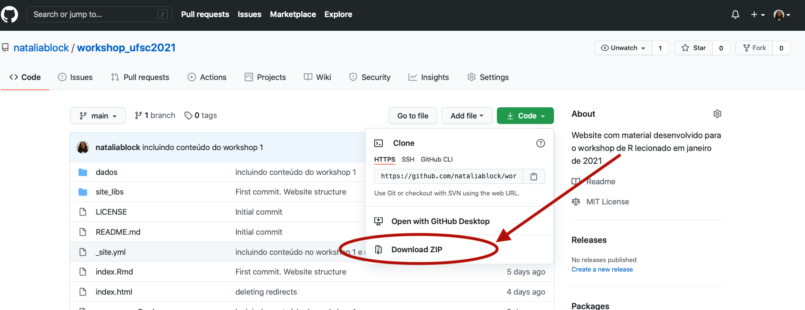

# Instalação do R e do RStudio

### Instale o R e o RStudio antes do primeiro workshop! Não realizaremos a instalação durante a aula.

Para instalar a linguagem R você deve acessar o [CRAN](https://cran.r-project.org). Logo na página de início terá os links para a instalação para cada sistema operacional. É só baixar o do seu computador e realizar a instalação.

Você pode baixar o IDE RStudio [neste link](https://rstudio.com/products/rstudio/download/). Selecione a opção RStudio Desktop Free. O site irá detectar o seu sistema operacional, basta fazer o download e instalar.

Caso tenha alguma dúvida você encontra uma explicação mais sistemática da instalação para cada sistema operacional [nesse link (em inglês)](https://datacarpentry.org/r-socialsci/setup.html).

Para uma explicação da instalação para Windows em português (talvez esteja um pouco defasada) [veja este material](http://material.curso-r.com/instalacao/).

Para mais detalhes sobre o R e o R Studio:

  * Veja este [tutorial do Data Carpentry](https://datacarpentry.org/r-socialsci/00-intro/index.html)
  * Leia o capítulo "O R e RStudio" do livro [Usando R: um Guia para Cientistas Políticos](http://electionsbr.com/livro/introducao-ao-r.html#o-r-e-rstudio)
  

# Como acompanhar o workshop online

A melhor forma de reter o conteúdo em um curso de programação é digitar o código e escrever seus próprios comentários e explicações no script ao longo da aula. Neste workshop utilizaremos o método "live coding" em que digitarei o código "ao vivo" ao mesmo tempo em que o explico. Contudo, é possível que encontremos alguns desafios pelo fato de estarmos fazendo este workshop online e por termos tão pouco tempo. A seguir proponho formas para que você possa acompanhar este curso da maneira mais proveitosa possível:
  
### Se possível acompanhe o workshop com duas telas
Como expliquei, a melhor forma de fazer o curso é digitando o código e fazendo anotações ao longo da aula. Desta forma, o ideal é que você possa assitir o video do workshop em uma tela e interagir com o R em outra. Caso não disponha de dois monitores (ou computadores) uma sugestão seria assitir os videos em um tablet ou no seu celular (talvez seja necessário dar um zoom na tela para enxergar os códigos) e trabalhar com o R no seu computador.
  
Caso nenhuma dessas soluções seja viável para você recomendo que assista o video da aula e posteriormente refaça todos os códigos segundo o roteiro do workshop disponível na aba "Workshops" deste site. O roteiro segue exatamente a ordem e as explicações do workshop, de forma que você pode prestar atenção apenas no video, caso não tenha como interagir com o R ao longo da aula, e testar os comandos disponíveis no roteiro sozinho em outro momento.

### Como proceder caso "se perca" ou "trave" no meio da aula.  
Teremos apenas um total de 8 horas para aprender uma boa introdução ao R. Você sairá desse workshop com os instrumentos básicos para limpar bases de dados e desenvolver gráficos por conta própria. No entanto, esse tempo é muito curto para aprender todos os fundamentos de R. Neste sentido, desenvolvi um workshop com base nos dados que vocês estão analisando na atual pesquisa do grupo, que lhes dará o conhecimento básico de como fazer no R o que vinha fazendo no Excel. Indicarei material complementar ao final do roteiro de cada workshop para quem quiser se aprofundar no tema por conta própria.

Ao aprender uma linguagem nova cometemos erros constantemente. Em linguagem de programação não é diferente. Mensagens de erro poderão ocorrer com frequência, e se você não conseguir entender qual foi o problema do seu código com rapidez é provável que "trave" em algum comando. Diferentemente de um workshop presencial, não poderei ver tela a tela para verificar o que aconteceu para que seu comando não "rodasse". Como teremos apenas 2 horas para cada encontro, sugiro que siga as seguintes recomendações caso isso ocorra com você:

  1. **Verifique a sintaxe do seu código**: você provavelmente pode ter deixado de digitar algo ou digitou alguma coisa errada. Verifique se não esqueceu de fechar aspas, parênteses, se colocou vírgulas nos lugares corretos. Geralmente o RStudio faz uma marcação em códigos que ele não reconhece, o que torna mais fácil identificar o possível erro. 
  2. **Verifique se fez o upload do pacote da função que está utilizando**: esse é um erro muito comum de quem está começando. Como ainda não temos familiaridade com os nomes das funções, geralmente esquecemos de fazer o upload dos pacotes. Confira se tem o pacote instalado e se fez o upload para a sua seção de trabalho (utilizando `library()` ou `require()` como veremos no workshop 1)
  3. **Recorra ao roteiro do workshop**: caso  não consiga identificar o problema em tempo hábil e já tenhamos seguido para outro comando (ou seja, caso se perca), vá até o roteiro do workshop aqui no site e identifique o código que "perdeu". Toda vez que não conseguir acompanhar a aula por algum motivo retorne ao roteiro. Está tudo lá.
  4. **Se a dúvida persistir peça ajuda antes do workshop seguinte**: caso tenha encontrado dificuldades em um workshop não desista! Retorne ao roteiro, leia-o e rode os comandos novamente. Identifique as dúvidas que permanecerem e peça ajuda (veja como mais abaixo). Tente resolver suas dúvidas antes do próximo workshop.

### Tirando dúvidas no workshop
Você terá muitas dúvidas ao longo do workshop e isso é ótimo! Caso suas dúvidas tenham a ver com comandos que não rodam peço que siga as recomendações que enumerei na seção anterior. De resto tentarei responder a todas no workshop. No entanto, lembre-se de que teremos apenas 2 horas para cada encontro. Caso sua dúvida seja conceitual provavelmente conseguirei responder prontamente. Se tiver dúvidas quanto a como desenvolver algo em R para além do que está no nosso roteiro, devo lhe responder dentro de uma destas três formas:

  1. Se for algo rápido de explicar demonstrarei logo
  2. Caso sua dúvida estiver em algum material complementar que eu já tenha disponibilizado farei referência a ele e peço que o verifique quando puder.
  3. Se for algo que irá demandar mais tempo e que provavelmente irá atrasar o resto do workshop, tentarei buscar material complementar sobre o assunto e/ou incluir uma seção no roteiro demonstrando a resposta após o workshop e os avisarei quando for publicado.

### Leia o roteiro do workshop anterior e faça as atividades propostas
Sugiro a leitura do material do workshop anterior antes do seguinte para relembrar os conceitos e tirar dúvidas. É impressindível que realize as atividades propostas entre os workshops pois o material produzido na atividade será necessário para começar as atividades do workshop seguinte. Por exemplo: na atividade do workshop 1 você terá que fazer o upload no R dos bancos que serão utilizados no workshop 2. Caso não tenha realizado a atividade você ficará atrasado na aula e não conseguirá acompanhar as explicações desde o início.

# Acesso aos materiais do workshop

Os dados trabalhados neste workshop e os scripts com as soluções das atividades estarão disponíveis no repositório do Github acessível no menu deste site. Os scripts com a solução das atividades estarão no repositório alguns minutos antes do workshop subsequente.

Os links no menu para repositório e para o dashboard, que será apresentado no primeiro workshop, abrem na mesma página. Para evitar sair do site é melhor abri-los em uma janela diferente. 

Para ter acesso aos dados você precisará baixar toda a pasta do respositório e, uma vez o download tendo finalizado na sua máquina, basta copiar a pasta "dados" e colar no seu diretório de trabalho (você fará isso na atividade do workshop 1).

Para baixar a pasta vá até o repositório, clique no botão verde "Code" e selecione a opção "Download ZIP" (veja a imagem abaixo)

  
# Buscando ajuda

Angely Bernardo será nossa monitora neste curso. Caso tenha dificuldades para realizar as atividades entre um workshop e outro entre em contato com ela. Angely está generosamente nos dando esse apoio, mas também estará aprendendo R como vocês. Se houver outras dificuldades que ela não consiga solucionar resolveremos juntos. O canal de comunicação será decidido no primeiro workshop.

# Créditos 

Este curso se baseia em diversos materiais disponíveis gratuitamente (e generosamente) na internet. Em grande medida me baseei no curso [R for Social Scientists](https://datacarpentry.org/r-socialsci/) do [Data Carpentry](https://datacarpentry.org), no [R Crash Course](http://tiagoventura.rbind.io/files/crash_course_gvpt) lecionado por [Tiago Ventura](http://tiagoventura.rbind.io) na University of Maryland, College Park, e no livro [R for Data Science](https://r4ds.had.co.nz) de Hadley Wickham e Garrett Grolemund.

# Fonte dos dados utilizados neste workshop

Dados de Exportação do estado de Santa Catarina. [Comexstat](http://comexstat.mdic.gov.br/pt/municipio/20930), Ministério da Economia. Acesso em 11/01/2021

Dados de Importação do estado de Santa Catarina. [Comexstat](http://comexstat.mdic.gov.br/pt/municipio/20931),Ministério da Economia. Acesso em 11/01/2021

Dados de Imigração. [SISMIGRA](https://portaldeimigracao.mj.gov.br/pt/dados/microdados/1733-obmigra/dados/microdados/401205-sismigra); [SINCRE](https://portaldeimigracao.mj.gov.br/pt/component/k2/itemlist/category/51-sincre), Ministério da Justiça e Segurança Pública. Acesso em 11/01/2021.