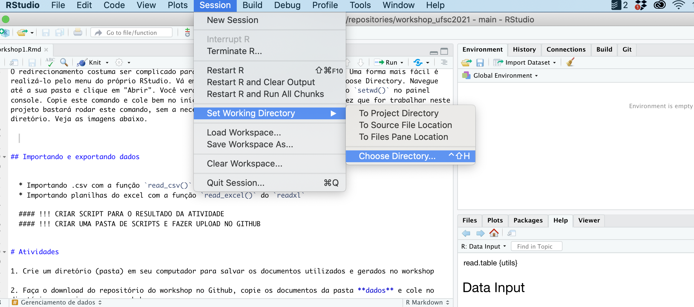
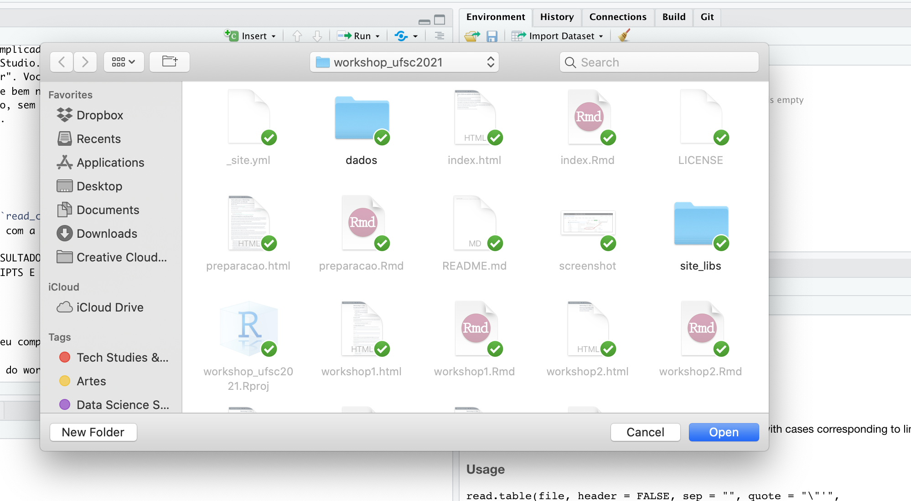
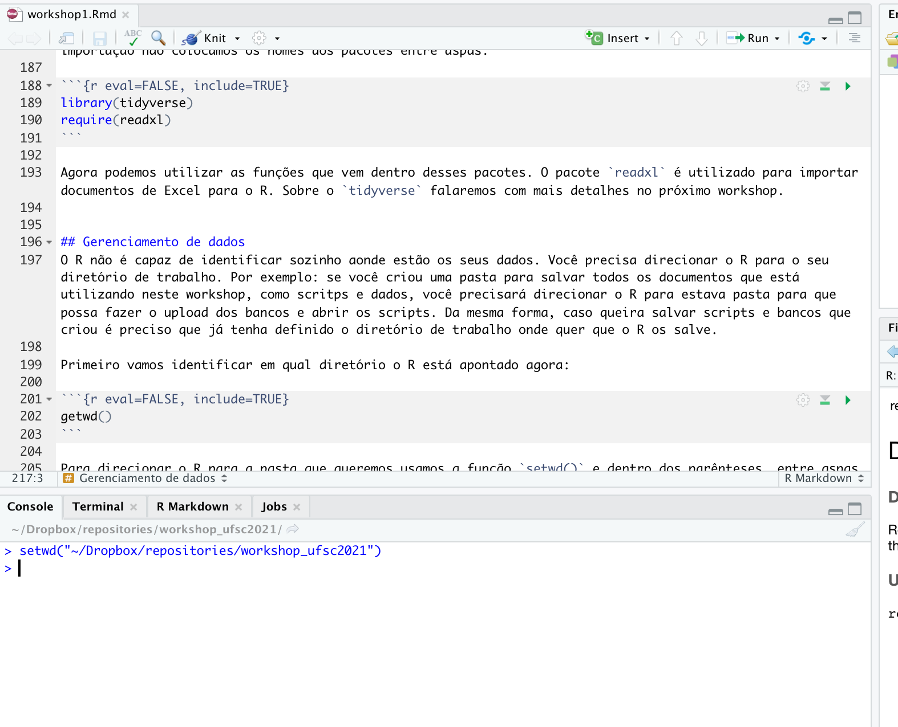

# Fundamentos de R

Para começar nós vamos:

  * Entender como o material está organizado no site e no repositório (o que é comando e o que é output na página)
  * Discutir a apresentação dos gráficos do dashboard (abrir em nova aba para evitar sair do site)
  * Conversar sobre a programação como meio e a comunicação da informação exposta pelos dados como fim
  * Diferenciar o R do RStudio  
  * Explorar o RStudio
  * Entender o que são os ambientes global e local e o uso de memória do computador pelo R 

## O que é o R?

O R é uma linguagem de programação especialmente utilizada para estatística e ciência de dados, apesar de estar sendo crescentemente utilizada para propósitos mais gerais (criação de websites, aplicativos de web, dashboards, entre outros).

O R é uma linguagem orientada a objetos e funcional. Desta forma, em R:

  * Tudo o que existe é um objeto (orientada a objetos)
  * Tudo o que acontece é uma chamada à uma função (funcional)
  
## Criando objetos em R

Você pode obter uma saída (também chamada de output) simplesmente digitando algum cálculo no console:
```{r echo=TRUE}
7 + 9
```

```{r echo=TRUE}
12/7
```

No entanto, a linguagem se torna mais útil quando **atribuimos valores a objetos**. Para criar um objeto precisamos dar-lhe um nome seguido do operador de atribuição `<-` e o valor que queremos atribuir.

```{r echo=TRUE}
alemanha<-9000
```

Nem todo o comando em R retornará alguma resposta. Ao criar um objeto é possível vê-lo no painel Environment do RStudio (no topo à direita) ou podemos digitar seu nome no console. O R retornará o valor atribuído a ele.

```{r echo=TRUE}
alemanha
```

Objetos podem ser nomeados da forma como preferir, mas existem algumas regras:

  * Não é possível começar nomes de objetos com números
  * O R é sensível a letras maiúsculas e minúsculas (`idade` é diferente de `Idade`)
  * Alguns nomes não podem ser utilizados pois são funções fundamentais no R como `if`, `else`, `for`
  * Apesar de ser permitido é melhor evitar qualquer outro nome de função para nomear objetos como `mean`, `data`, `df`.

Objetos podem receber qualquer tipo de valor, inclusive podendo ser palavras, que chamamos de character ou string. Uma string deve ser sempre apresentada ao objeto entre aspas para que seja interpretada pela linguagem como uma palavra.

Vale destacar que é bom evitar acentuação sempre que possível no seu código. É muito comum encontrarmos problemas para rodar o código pois a linguagem não compreendeu a acentuação.

```{r echo=TRUE}
nome_pais<-"Alemanha"

nome_pais

```

Como veremos a diante os objetos podem conter vários tipos de estruturas de dados, como os dataframes, que são as tabelas como as que trabalhamos no Excel. 

É possível fazer operações com objetos
```{r echo=TRUE}
alemanha * 2
```

Veja que o R apresenta o resultado mas não o "salva". Se quisermos ter esse resultado salvo precisamos atribuí-lo a um objeto:

```{r echo=TRUE}
alemanha_mult<-alemanha*2

alemanha_mult
```

Também é possível fazer operações entre objetos

```{r echo=TRUE}

italia<-3000

total_turistas<-alemanha + italia

total_turistas

```

O R é bastante flexível; é possível subscrever o valor contido em um objeto por outro. Veja que no código abaixo estou substituindo o valor 9000 por 10000. O valor 9000 será perdido

```{r echo=TRUE}
alemanha<-10000

alemanha
```


É possível verificar todos os objetos que criamos no painel Global Environment do RStudio. Também é possível ver todos os objetos do ambiente global digitando a função `ls` no console
```{r echo=TRUE}
ls()
```


Caso queiramos remover um objeto do ambiente global do R utilizamos a função `rm()`

```{r}
rm(alemanha)
```

Também podemos remover vários objetos ao mesmo tempo

```{r}
rm(alemanha_mult, italia, nome_pais, total_turistas)
```


## Funções e seus argumentos

Como dito anteriormente, tudo o que existe no R é um objeto e tudo o que acontece é uma chamada a uma função. Funções são scripts "empacotados" que automatizam conjuntos de códigos. Muitas funções são pré-definidas, as quais chamamos de funções da base R, ou estão disponíveis em pacotes os quais precisamos instalar e importar (vamos tratar sobre isso mais adiante).

Uma função normalmente recebe uma ou mais entradas (inputs) chamadas **argumentos** e geralmente (mas não sempre) **retornam valores**.

Um exemplo de função é a `sqrt` que calcula a raiz quadrada de um valor. O **argumento** desta função é o valor o qual queremos calcular a raiz, e o valor que o R retorna, o output, é o resultado do cálculo. Ao executar a função dizemos que estamos **chamando a função**. Vejamos:

```{r echo=TRUE}
sqrt(16)
```

Argumentos podem ser não apenas números, mas também outros tipos objetos. Para saber que tipo de argumento recebe uma função devemos verificar a documentação (como veremos a seguir). Alguns argumentos podem ser especificados pelo usuário ou, caso não sejam, recebem um valor default especificado pelo desenvolvedor da função. Esse tipo de argumento é chamado de **opção** da função. As opções são normalmente utilizadas para alterar a forma como a função opera, como tirar um valor ou um símbolo indesejado, por exemplo. No entanto, caso queira algo específicoo, você deve especificar o valor desejado para ser utilizado ao invés do default.

Vejamos a função `round()`, utilizada para arredondar valores

```{r echo=TRUE}
round(3.14159)

```

Repare que a função arredonda para o valor inteiro. Mas digamos que eu queira que o número seja arredondado para dois dígitos depois do ponto. Como descubro como fazer isso? Podemos utilizar `args(round)`, que retornará os argumentos desta função, ou podemos pedir ajuda utilizando `help(round)` ou `?round`, que retornará a sua documentação (aparecerá no painel de baixo à direita do RStudio)

```{r echo= TRUE}

args(round)

```

```{r}
?round
```

A documentação mostra que podemos incluir como o segundo argumento da função (que é uma opção) o número de digitos desejados

```{r echo=TRUE}

round(3.14159, digits= 2)

```

Caso você siga a sequência de argumentos elencadas na documentação não é preciso digitar o nome da opção

```{r echo=TRUE}
round(3.14159, 2)
```

## Instalando e importando funções

Como explicado anteriormente, existem função que não fazer parte da base do R e precisamos instalá-las e importá-las para que sejam usadas. Vamos instalar dois pacotes que iremos usar no workshop: o `tidyverse` e o `readxl`. Para isso utilizamos a função `install.packages()`. Veja que o nome do pacote deve vir entre aspas dentro dos parenteses

```{r eval=FALSE, include=TRUE}
install.packages("tidyverse")
install.packages("readxl")

```

Não basta instalar o pacote. Toda vez que iniciarmos o R precisamos importar os pacotes que desejamos utilizar.
Vamos importar estes pacotes. Para isso podemos utilizar a função `library()` ou `require()`. Para a importação não colocamos os nomes dos pacotes entre aspas.

```{r eval=FALSE, include=TRUE}
library(tidyverse)
require(readxl)
```

Agora podemos utilizar as funções que vem dentro desses pacotes. O pacote `readxl` é utilizado para importar documentos de Excel para o R. Sobre o `tidyverse` falaremos com mais detalhes no próximo workshop.


## Gerenciamento de dados
O R não é capaz de identificar sozinho aonde estão os seus dados. Você precisa direcionar o R para o seu diretório de trabalho. Por exemplo: se você criou uma pasta para salvar todos os documentos que está utilizando neste workshop, como scritps e dados, você precisará direcionar o R para esta pasta para que possa fazer o upload dos bancos e abrir os scripts. Da mesma forma, caso queira salvar scripts e bancos que criou é preciso que já tenha definido o diretório de trabalho onde quer que o R os salve.

Primeiro vamos identificar para qual diretório o R está apontado agora:

```{r eval=FALSE, include=TRUE}
getwd()
```

Para direcionar o R para a pasta que queremos usamos a função `setwd()` e dentro dos parênteses, entre aspas, digitamos o caminho de onde esta pasta se encontra no computador. Exemplo: no meu computador (MAC) eu criei uma pasta chamada "workshop_ufsc2021" onde salvo todos os documentos que criei para esse workshop. Ele está dentro da pasta "repositories" no meu diretório do Dropbox. Assim, para apontar esta pasta para o R eu faço o seguinte:

```{r eval=FALSE, include=TRUE}
setwd("~/Dropbox/repositories/workshop_ufsc2021")
```

Para verificar se o R fez o redirecionamento basta digitar `getwd()` novamente.

Para encontrar o caminho correto da sua pasta no Windows clique com o botão direito sobre um dos documentos dentro da pasta e clique em "Propriedades". Na janela que abrir, na aba "Geral" você encontrará o caminho em "Localização". Geralmente os caminhos no Windows começam com `C:\`. 

O redirecionamento costuma ser complicado para quem está começando com a linguagem. Uma forma mais fácil é realizá-lo pelo menu do próprio RStudio. Vá em Session > Set Working Directory > Choose Directory. Navegue até a sua pasta e clique em "Abrir". Você verá que o próprio RStudio irá "digitar" o `setwd()` no painel console. Copie este comando e cole bem no início do seu script. Assim, da próxima vez que for trabalhar neste projeto bastará rodar este comando, sem a necessidade de voltar ao menu do RStudio para redirecionar o diretório. Veja as imagens abaixo.  







## Importando e exportando dados
O R comporta vários tipos de estrutura de dados, como veremos no próximo workshop. No entanto, focaremos nos data frames, que são estruturas tabulares de dados, semelhantes às tabelas de excel. Na seção vamos aprender como abrir tabelas/planilhas no R.

Antes de tudo é preciso se certificar de que o R está apontando para o diretório em que estão as tabelas que se quer abrir, como vimos na seção anterior. 

As tabelas podem estar em extensões diferentes. Existem inúmeras extensões, mas as mais comuns são as planilhas de excel (.xlsx), os documentos .csv e os txt. Vamos focar nesses três tipos e ao longo do workshop usaremos tabelas de excel e csv. No material complementar você encontra documentação explicando como abrir outros tipos de bancos de dados (SPSS, STATA, json, etc). 

Para abrir documentos .csv utilizamos a funcão `read_csv()` do pacote `readr`, que é parte integrante do `tidyverse` que baixamos na seção sobre importação de pacotes. Desta forma, primeiro certifique-se de que fez o upload do tidyverse antes de rodar essa função.

Irei abrir o banco de imigração e salvarei em um objeto que chamarei de migração. O nome do documento é `migracao_completo.csv`. A função `read_csv()` deverá receber como argumento o nome do documento com a extensão entre aspas. Caso o banco esteja em pasta diferente do diretório que está apontado para o R é preciso colocar o caminho da pasta onde estão os dados, seguido de barra (/) e o nome do documento. Veja a seguir:

```{r eval=FALSE, include=TRUE}
#para fazer o upload do tidyverse:
#library(tidyverse)
#como já realizamos o upload anteriormente não é necessário rodar essa linha de novo, por isso
#está comentada

#caso o documento esteja no diretório que você apontou basta criar o objeto e utilizar a função read_csv como asseguir:

migracao<-read_csv("migracao_completo.csv")


```
```{r eval=FALSE, include=TRUE}

#caso o documento esteja em outra pasta é necessário colocar o caminho antes do nome. No meu caso o banco se encontra na pasta "dados" que está dentro do repositório para o qual apontei o R. Dessa forma, preciso indicar o nome da pasta antes, seguido de barra, e o nome do arquivo

migracao<-read_csv("dados/migracao_completo.csv")

```

A mensagem que aparece no console indica como a função leu cada coluna do banco. Ela atribuiu o tipo character a todas as colunas, ou seja, o R entendeu que todas as colunas continham palavras. É possível alterar as colunas para números, fatores ou outros tipos de dados. Veja como fazer isso no material adicional a seguir. Nos próximos workshops vamos aprender a alterar esses tipos de dados.

Repare o que banco de dados aparece no painel Environmet do RStudio. Para dar uma olhada nos dados use a função `View()` como a seguir:

```{r eval=FALSE, include=TRUE}
View(migracao)
```

Também é possível ver o banco clicando no ícone com a imagem de uma tabela ao lado direito do banco no painel Environment do RStudio.

Para abrir bancos com outras extensões seguimos a mesma lógica anterior. Para importar bancos com extensão .txt utilizamos a função `read_table()` também do pacote `readr` do `tidyverse`. Veja o exemplo a seguir:

```{r eval=FALSE, include=TRUE}

nome_objeto<-read_table("meu_banco.txt")

```

Para abrir planilhas do excel utilizamos a função `read_excel` do pacote `readxl` que instalamos na seção anterior. Não esqueça de verificar se fez o upload do `readxl`

```{r eval=FALSE, include=TRUE}

nome_objeto<-read_excel("meu_banco.xlsx")

```

Você pode exportar bancos de dados que tenha criado ou alterado no R. Para isso basta utilizar as funções `write_csv()` ou `write_excel` dependendo da extensão que quer salvar os seus bancos. Para isso, após escrever o nome da função coloque dentro dos parênteses o nome do objeto em que você salvou a tabela, seguido de vírgula e o nome que quer dar ao banco entre aspas. O banco será salvo no diretório para o qual o R está apontando. Veja os exemplos abaixo.
```{r eval=FALSE, include=TRUE}

#caso eu queira salvar o meu banco em arquivo csv:

write_csv(nome_do_objeto_com_banco, "nome_do_banco.csv")

#para salvar uma planilha de excel

write_excel(nome_do_objeto_com_banco, "nome_do_banco.xlsx")

```

# Material complementar

[Cheat sheet](material_adicional/data-import.pdf) elaborado pelo RStudio sobre importação de dados com tidyverse. Nele são apresentados os argumentos das funções mais importantes do pacote readr, dentre eles da `read_csv()`

[Documentação do readxl](https://readxl.tidyverse.org) com as funções do pacote demonstrando como importar planilhas do excel, listar nome de planilhas e abrir planilhas diferentes do excel para o R.

# Atividades

1. Crie um diretório (pasta) em seu computador para salvar os documentos utilizados e gerados no workshop

2. Faça o download do repositório do workshop no Github, copie os documentos da pasta **dados** e cole no diretório que criou para o workshop

3. Aponte o R para este diretório como explicado na seção **Gerenciamento de dados**. 

4. Faça o upload dos bancos `migracao_completo.csv`, `export_sc.xlsx` e `import_sc.xlsx`, salvando-os em objetos chamados respectivamente de `migracao`, `exportacao` e `importacao`. Perceba que os nomes dos objetos a serem criados não têm nenhuma acentuação! Evite acentuação ao programar! Siga as instruções da seção **Importando e exportando dados**. 

5. Caso tenha desenvolvido um script próprio com suas anotações neste primeiro workshop, salve-o nesta pasta

6. Essa atividade deve ser cumprida para iniciarmos o próximo workshop. Precisaremos desses bancos já importados e o diretório já apontado para o R para iniciarmos a aula.


