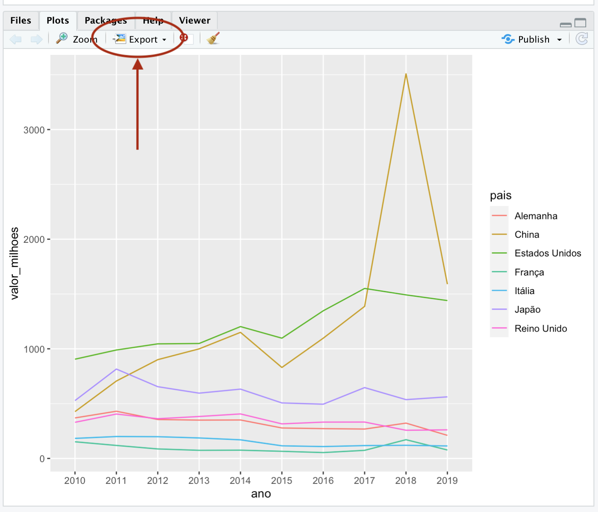
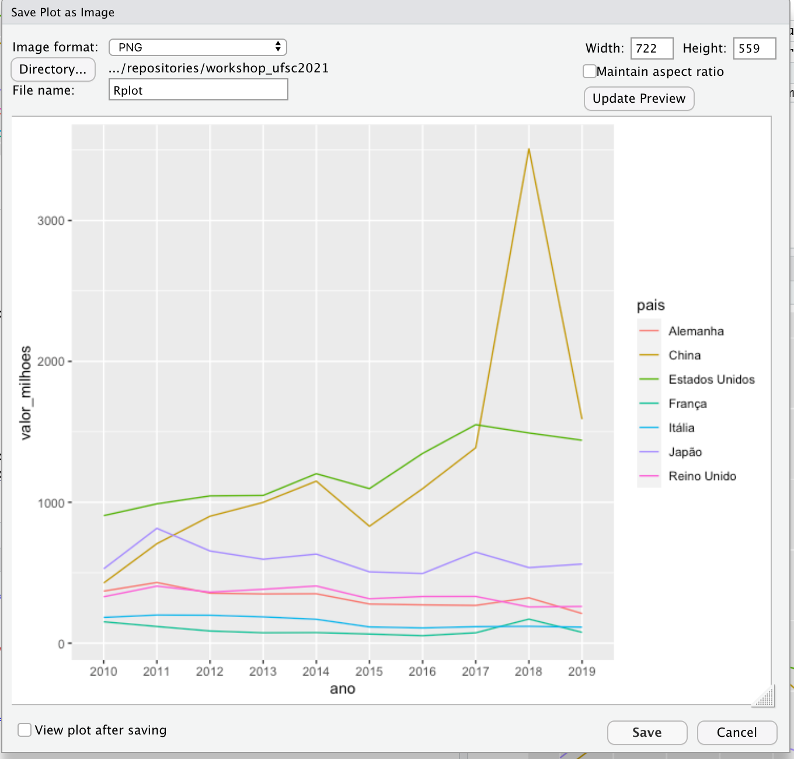
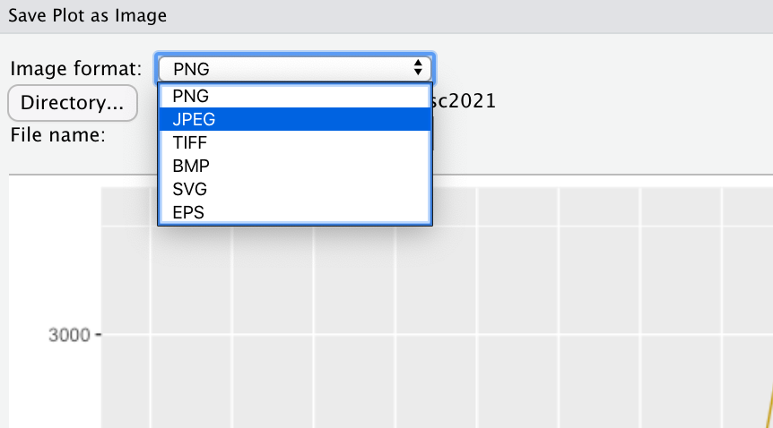
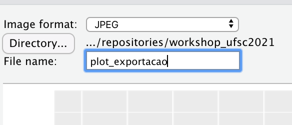
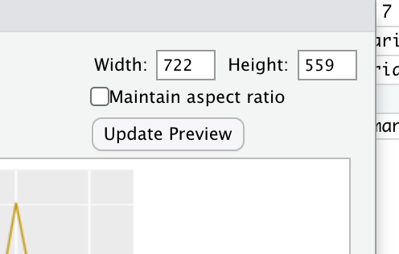
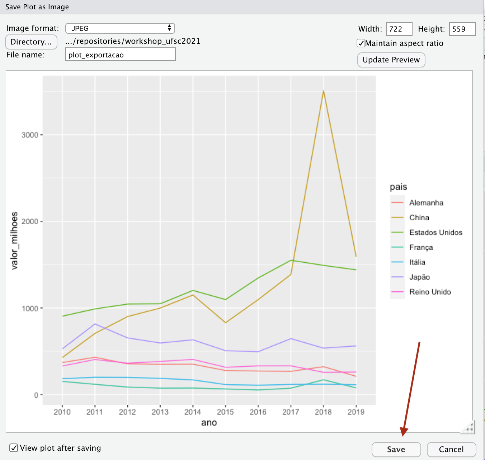

# Manipulação de dados com tidyr e elaboração de gráficos com ggplot2

## Manipulação de dados com tidyr

Antes de tudo, vou apontar o R para meu diretório, fazer o upload dos bancos que vamos usar e das tabelas que trabalharemos
```{r echo=TRUE, message=FALSE, warning=FALSE}

#Apontando o R para meu diretório
setwd("~/Dropbox/repositories/workshop_ufsc2021")

#upload de pacotes
library(tidyverse)
library(readxl)

#upload de bancos

#banco de migracao
migracao<-read_csv("dados/migracao_completo.csv")

#banco criado na atividade 2: migracao_alemanha
migracao_alemanha<-read_csv("dados/migracao_alemanha.csv")

# banco criado na atividade 2: migracao_sexo
migracao_sexo<-read_csv("dados/migracao_sexo.csv")

#banco de exportacao
exportacao<-read_excel("dados/export_sc.xlsx")
```


Como comentei no workshop anterior, o pacote tidyr (incluso no tidyverse) nos permite remodelar a estrutura da tabela, transformando linhas em colunas e vice-versa. Por vezes nossas tabelas precisam ser reestruturadas por causa do tipo de gráfico que queremos elaborar ou da forma como determinada função exige que os dados sejam apresentados. 

As tabelas podem ser estruturadas de duas formas, em formato long, que em português costumamos chamar de painel, ou no formato wide. O formato painel apresenta todos os valores observados das variáveis para a unidade de análise nas linhas da tabela, enquanto no formato wide os valores observados para cada unidade de análise se encontram organizados em colunas separadas. 

Vamos primeiro entender qual é a nossa unidade de análise. Para o nosso caso, estamos analisando os valores de migração, exportação e importação de Santa Catarina **por país e ano**. **País e ano são nossas unidades de análise**. Desta forma, se os valores de uma tabela forem apresentados **por país e por ano nas linhas a tabela terá um formato long**. Se elas forem apresentadas com **país na linha e ano na coluna, ou ano na linha e e país na coluna a tabela terá o formato wide**.

No caso das nossas tabelas, a tabela de migração apresenta formato de painel (long). Repare que para cada caso de nosso banco os países e anos estão nas linhas.
```{r echo=TRUE}

migracao

```

Por sua vez, nossas tabelas de exportação e importação estão no formato wide pois os países estão na linha e os anos estão nas colunas, ou seja, as colunas apresentam os valores de exportação e importação para cada ano. 

```{r echo=TRUE}

exportacao


```

No entanto, para elaborarmos os gráficos iguais aos do dashboard teremos que alterar a estrutura dessas tabelas. Para criarmos um gráfico de linha de exportação a tabela precisa estar em formato long, enquanto para montarmos um gráfico do tipo dumbbell para migração de mulheres e homens precisamos do dados organizados em formato wide. 

## Transformando tabela wide para long: limpando a tabela exportação

Para alterar o formato da nossa tabela `exportacao` usaremos a função `pivot_longer` do `tidyr`. Ela recebe como argumentos os seguintes parâmetros:

* `cols`= colunas que se transformarão do formato wide para long. Podemos utilizar `:` se as colunas a serem reformatadas estão em uma área específica do dataframe, ou podemos criar um vetor, utilizando a função `c()` que vimos no workshop 2, com os nomes das colunas que iremos alterar. No caso da tabela migração as colunas estão todas em uma área específica, então iremos usar a primeira opção.

* `names_to`= será a nova coluna criada a partir dos nomes das colunas. Insira neste argumento o nome que esta nova coluna receberá na forma de string, ou seja, entre aspas. No nosso exemplo daremos o nome de `ano_bruto`. Escolhi esse nome porque a seguir criaremos outra coluna apenas com os anos a partir desta.

* `values_to`= será a nova coluna que receberá os valores que serão colapsados no formato long a partir das antigas colunas. Colocaremos aí o nome desta nova coluna em formato string, que será `valor`. 

Salvarei essa transformação no objeto `exportacao` pois este será o formato final do nosso banco. Estamos subscrevendo o banco anterior, salvando, assim, espaço em memória.

```{r echo=TRUE}
exportacao<- exportacao%>%
  pivot_longer(cols=`2019 - Valor FOB (US$)`:`2010 - Valor FOB (US$)`,
               names_to = "ano_bruto",
               values_to = "valor")

exportacao
```

Veja no dashboard que para criar um gráfico de linhas precisaremos dos valores de cada país por ano. Dessa forma, temos que criar uma coluna apenas com os anos. Para isso utilizaremos o pacote `stringr`, que faz parte do `tidyverse`, para retirarmos apenas os anos da coluna `ano_bruto` e salvarmos em uma nova coluna que chamarei de `ano`.

Não veremos o `stringr` com detalhes neste workshop. Resumidamente, esse pacote possui funções para a manipulação de strings, ou seja, palavras. Deste pacote, utilizaremos a função `substr`, de "substract" que irá retirar da coluna `ano_bruto` os elementos que incluiremos nos argumentos `start` e `stop`. Queremos retirar os quatro primeiros elementos da string que nos dão os anos. Assim, `start` recebe 1 e `stop` recebe 4. Vamos salvar o resultado em uma nova variável chamada `ano`. Para isso estamos usando o `$` para acessar uma coluna na tabela, como vimos no workshop passado, e escrevemos o nome da nova coluna logo depois do símbolo.

```{r echo=TRUE}
exportacao$ano<-substr(exportacao$ano_bruto, start=1, stop=4)

exportacao

```

### Criando novas colunas com base em colunas existentes

Para finalizarmos o limpeza do banco de exportação para que fique pronto para criarmos o gráfico ainda precisamos fazer algumas pequenas alterações. Veja que os valores das exportações como aparecem são difíceis de ler pois não existe pontuação ou dígitos que nos indiquem centenas e milhares. Para que a leitura dos valores ficasse mais compreensível nos gráficos do dashboard transformei os valores em milhões simplesmente dividindo os valores da coluna `valor` por um milhão. Para fazer este cálculo retornamos ao pacote `dplyr` para utilizar a função `mutate` que nos permite realizar cálculos e gerar novas colunas a partir de valores de colunas já existentes. Logo após a função `mutate`, entre parênteses, damos o nome à nova variável (que no nosso exemplo será `valor_milhoes`), seguido de `=` e o cálculo que queremos realizar (veja no código abaixo).


Além dessa alterção, precisamos filtrar apenas os países de interesse da coluna país. Faremos da mesma forma como apresentado no workshop anterior: criaremos um vetor com o nome dos países e o incluíremos na função filter com símbolo `%in%`. Por fim, vamos selecionar apenas as colunas que nos interessam, `País`, `valor` e `ano` e salvaremos todas as alterações no objeto `exportacao`. Por fim, utilizaremos mais uma função do `dplyr`, a `rename`, para alterar o nome da coluna `País` para `pais`, assim evitamos acentos em nossa programação. Faremos todas essas alterações em apenas um bloco de código

```{r echo=TRUE}

#primeiro crio o vetor com os países que serão filtrados
paises<-c("Alemanha", "China", "Estados Unidos", "França", "Itália", "Japão",
          "Reino Unido")


exportacao<-exportacao%>%
  mutate(valor_milhoes=valor/1000000)%>%
  filter(País %in% paises)%>%
  select(País, valor_milhoes, ano)%>%
  rename(pais=País)
  
exportacao
```

Este será o banco que utilizaremos para criar nossos gráficos de exportação. Vamos salvá-los para não ter que rodar novamente todos esses códigos. Vou salvá-lo como csv com o nome de "exportacao_final".

```{r}

write_csv(exportacao, "dados/exportacao_final.csv")
```


## Transformando tabela long para wide: limpando a tabela migracao_sexo

Agora vamos fazer algumas alterações na tabela `migracao_sexo` que foi criada nas atividades do workshop 2. Para criarmos um gráfico do tipo dumbbell como o apresentado no dashboard precisamos que a tabela apresente o nome dos países e os valores de entrada no estado por sexo nas colunas. Para isso, utilizaremos a função do `tidyr` chamada `pivot_wider`. Ela receberá os seguintes argumentos:

* `names_from` = deve receber a coluna que deve ser reestruturada de long para wide. Queremos ter uma coluna para valores de Feminino e outra para Masculino, assim esse argumento receberá a coluna que nos diz o sexo, que é `SEXO_DESCRICAO`.

* `values_from` = deve receber a coluna com os valores que as novas colunas devem receber. No nosso caso é `total_sexo`.

Vou salvar os resultados no próprio objeto `migracao_sexo`, subscrevendo a tabela anterior.

```{r eco=TRUE}

migracao_sexo<-migracao_sexo%>%
  pivot_wider(names_from = SEXO_DESCRICAO, values_from = total_sexo)

migracao_sexo

```

Para finalizarmos esse banco ainda precisamos alterar a forma como estão escritos os nomes dos países. Repare que neste banco os nomes estão escritos de forma completamente diferente do banco de exportação. Vamos uniformizar esses nomes. Para isso vamos usar a função `mutate` para criar uma nova coluna a partir da coluna `PNASC_DESC` que se chamará `paises`. Dentro de `mutate` vamos utilizar outra função do dplyr chamada `case_when` que nos permite recodificar os casos. Assim, diremos ao `dplyr` que toda vez (`case_when`) a coluna `PNASC_DESC` for igual (`==`) à `"REPUBLICA POPULAR DA CHINA"` queremos que a nova coluna `paises` receba como valor (`~`) `China`. Faremos isso com todos os países. Salvarei as alterações no mesmo objeto migracao_sexo. Veja abaixo como fica a sintaxe.

```{r echo=TRUE}
migracao_sexo<-migracao_sexo%>%
  mutate(paises=case_when(PNASC_DESC=="REPUBLICA POPULAR DA CHINA" ~ "China",
                          PNASC_DESC=="REINO UNIDO" ~ "Reino Unido",
                          PNASC_DESC=="JAPAO" ~ "Japão",
                          PNASC_DESC=="ITALIA" ~ "Itália",
                          PNASC_DESC=="FRANCA" ~ "França",
                          PNASC_DESC=="ESTADOS UNIDOS DA AMERICA" ~ "Estados Unidos",
                          PNASC_DESC=="ALEMANHA" ~ "Alemanha"))

migracao_sexo
```

Vamos salvar este banco como csv com o nome de `migracao_sexo_final`.

```{r}
write_csv(migracao_sexo, "dados/migracao_sexo_final.csv")
```


## Visualização de dados com ggplot2

Agora que já temos nossos dados limpos e estruturados podemos pensar em elaborar gráficos com eles. Podemos elaborar gráficos apenas com a base do R, porém, existe um pacote ainda mais poderoso para elaboração de gráficos: o ggplot2. Apesar de ser mais complexo com relação à sintaxe do código, o ggplot2 permite elaborar gráficos altamente customizáveis e, como resultado, entrega visualizações de dados bem mais profissionais. Desta forma, vamos focar o restante deste workshop em compreender a sintaxe do ggplot2 e como customizar nossos gráficos com esse pacote.

### A gramática em camadas do ggplot2

O ggplot2, como dito anteriormente, é um pacote para visualização de dados e, assim como o `dplyr` e o `tidyr`, faz parte do `tidyverse`. Ele segue uma sintaxe que chamamos de "gramática de gráficos" em que o gráfico é contruído de camada em camada. O bloco de código abaixo apresenta conceitualmente a estrutura básica das camadas para se construir um gráfico. Camadas adicionais podem ser adicionadas para customizar o gráfico. 

```{r eval=FALSE, include=TRUE}
ggplot(data = <NOME_DO_BANCO>, mapping = aes(<MAPEAMENTO>) ) +
  <GEOM_FUNCTION>(
    stat = <ESTATISTICA>,
    position= <POSICAO>) +
  <COORDINATE_FUNCTION> +
  <FACET_FUNCTION>
  )
```

Vamos entender essa sintaxe:

1. Primeiro começamos o bloco de código chamando a função `ggplot`. Então abrimos parênteses para começar a escrever nossa primeira camada. O primeiro argumento dessa função é o banco de dados que utilizaremos para criar o gráfico, seguido de vírgula. Após a vírgula, vamos realizar o mapeamento do gráfico com o argumento `aes` (de aesthetics, estética em ingês). Aqui nós iremos indicar quais colunas do nosso banco devem entrar no eixo x e no eixo y. Essa é a nossa primeira camada. Para adicionar uma segunda camada digitamos `+` ao final desta camada.

2. A segunda camada começa com a função que indica o tipo de gráfico que iremos montar. A função sempre começa com `geom_` que indica a "geometria" ou o desenho do gráfico. Por exemplo, se for um gráfico de barras a função será `geom_bar`, se for de linha `geom_line`, se for um gráfico de dispersão, em que cada observação da tabela será um ponto no gráfico, utilizaremos `geom_point`. Existem diversas geometrias para o gráfico, mas em nosso workshop vamos focar em gráficos de linha e de barras pois são os que melhor apresentam os dados que estamos trabalhando. Para conhecer as outras possibilidades de gráficos veja a documentação do ggplot2 e os tutoriais que inclui no material complementar.

Logo após a função `geom_`, dentro dos parênteses temos o argumento stat, que indica a estatística que será utilizada sobre os dados. Nem sempre este argumento é utilizado. Podemos utilizar neste argumento a média, proporção, etc. No caso dos nossos dados queremos que o gráfico apresente extamante os números observados na tabela, por isso usamos como argumento, principalmente em gráficos de barra, "identity".

O próximo argumento desta camada é a posição da nossa geometria. Nem sempre ela será necessária também. Com ela podemos indicar, por exemplo, se queremos o nosso gráfico de barras agrupados um do lado do outro (`dodge`), ou todas as categorias de uma variável na mesma barra (`stacked`), etc. Ao finalizar essa camada seguimos para a seguinte com `+`

3. A próxima camada indica o sistema de coordenadas do gráfico. O sistema default do `ggplot2` é o sistema cartesiano, mas existem vários outros sistemas de coordenadas possíveis. Nesse curso vamos trabalhar apenas com o sistema cartesiano, possívelmente apenas alterando as posições de x e y para termos outras possibilidades de visualização por meio da função `coord_flip()`

4. A última camada apresentada no código acima (que não necessariamente será a última camada do gráfico) é uma camada opcional chamada `facet`. Esta camada permite dividir o seu gráfico em subgráficos, cada um deles apresentando um subconjunto dos dados. Essa é uma função particularmente útil quando queremos elaborar visualizações para variáveis com várias categorias.

Neste workshop vamos focar nas duas primeiras camadas que nos permitem construir o corpo do gráfico. No workshop 4 veremos como customizar nossos gráficos, então veremos as últimas duas camadas, além de camadas complementares que nos permitem alterar cor, incluir título, alterar fundo, etc.

Vamos ver na prática como essas camadas são construídas. Vamos utilizar o banco `migracao_sexo` elaborado na atividade 2 para criar um gráfico de barras apresentando o total de migrantes alemães que entraram em Santa Catarina por ano.

```{r echo=TRUE}
ggplot(migracao_alemanha, aes(x=ano, y=total))+
  geom_bar(stat = "identity")
```

Veja que para chegar a este gráfico construímos 2 camadas. Começamos usando a função `ggplot`, incluindo o nome do banco a ser utilizado, seguido de vírgula e o argumento `aes` em que dizemos ao ggplot qual variável entra no eixo x e qual entra no eixo y. Queremos que x sejam os anos e y o total de migrantes. Finalizamos essa camada com o `+` para incluir a segunda camada. Na segunda camada indicamos que queremos um gráfico de barras com a função geom_bar, e entre parênteses usamos o argumento `stat="identity` para indicar ao ggplot que queremos que as barras representem exatamente o valor indicado na tabela. 

Mas existe um problema no eixo x: os anos estão aparecendo com decimais. Isso tem a ver com a discussão do workshop passado sobre tipos de dados. Vamos usar a função `glimpse` para verificar como estão armazenados esses dados.

```{r echo=TRUE}
glimpse(migracao_alemanha)
```

Repare que o ano está como um valor numérico que aceita dígitos (double). Como discutimos na semana passada, nossa variável de ano deve ser um fator, pois não é uma quantidade e sim um tipo de categoria. Vamos realizar a alteração de numérico para fator, como vimos no workshop passado, e rodar novamente o código para criar o gráfico.

```{r echo=TRUE}

migracao_alemanha$ano<-as.factor(migracao_alemanha$ano)

ggplot(migracao_alemanha, aes(x=ano, y=total))+
  geom_bar(stat = "identity")

```

Veja que após a alteração do tipo de dado o gráfico apresenta um ano para cada barra. No próximo workshop veremos como customizar esse gráfico, alterando cores, mudando label dos eixos, incluindo título, etc.

Agora vamos trabalhar com nosso banco de exportação. Digamos que queremos criar um gráfico de barras com os valores de exportação para a China. No caso do nosso banco `migracao_alemanha` já tínhamos o banco recortado apenas com dados da Alemanha. No caso do banco de exportação podemos utilizar o `dplyr` para filtrar apenas a China e utilizar o ggplot para plotar o gráfico logo depois no mesmo bloco de gráficos utilizando o `%>%`. Repare que como estamos utilizando a função `ggplot` seguido de um `%>%` não é necessário colocar o nome do banco utilizado como argumento pois já especificamos no começo do bloco de código, na primeira linha.

```{r echo=TRUE}
exportacao%>%
  filter(pais=="China")%>%
  ggplot(aes(x=ano, y=valor_milhoes))+
  geom_bar(stat="identity")


```


Vamos explorar um pouco mais o gráfico de barras. Digamos que queremos ver a evolução das exportação de todos os países para todos os anos. Cada ano apresentaria uma barra com os valores de cada país. Para isso, na primeira camada teremos que indicar no argumento `aes` (lembre-se que é ele que criar a "estética" do gráfico) que cada barra representará um país. Para isso utilizamos o argumento `fill`. Na camada que cria a geometria do gráfico, utilizaremos o argumento `position` dentro da função `geom_bar` como apresentado no bloco de códigos conceitual acima. Em `position` queremos indicar ao ggplot que queremos as barras agrupadas, então utilizamos o argumento `position_dodge()`

```{r echo=TRUE}
exportacao%>%
  ggplot(aes(x=ano, y=valor_milhoes, fill=pais))+
  geom_bar(stat="identity", position=position_dodge())
```

Repare, no entanto, que esse gráfico não é muito legível. Ele está muito tulmutuado, com muitas barras. Uma alternativa, se quisessemos insistir no gráfico de barras, seria utilizar a camada de `facet` (camada 4 do nosso bloco de código conceitual acima) e retirar os argumentos `fill` e `position` da primeira e segunda camada. Faríamos um facet por país, que geraria um gráfico com 7 subgráficos, um para cada país. Veremos como fazer isso no próximo workshop.

Uma segunda opção seria plotar um gráfico de linha como temos em nosso dashboard. Para isso, ao invés de utilizarmos o `geom_bar` na segunda camada utilizaremos a função `geom_line`. Na primeira camada, além dos argumentos referentes aos eixos, teremos que colocar mais dois: o `group` e o `colour`. O argumento `group` indica ao ggplot sobre o quê se refere cada linha do gráfico, que no nosso caso são os países. O argumento `colour` indica ao ggplot que cada país terá cores diferentes.

```{r echo=TRUE}
exportacao%>%
  ggplot(aes(x=ano, y=valor_milhoes, group=pais, colour=pais))+
  geom_line()

```


Gráficos também podem ser salvos dentro de objetos. Pode ser útil salvá-los ao longo de um projeto para não ter que ficar rodando repetidamente o mesmo bloco de código para gerar o gráfico.

```{r echo=TRUE}

plot_exportacao<-exportacao%>%
  ggplot(aes(x=ano, y=valor_milhoes, group=pais, colour=pais))+
  geom_line()

plot_exportacao

```


### Salvando gráficos do ggplot2

Podemos salvar nossos gráficos por meio do próprio R Studio. Nas imagens a seguir mostro o passo a passo.

1. No painel da direita, na parte de baixo, selecione a aba "Plots". O gráfico que quer salvar deve estar aparecendo neste painel. Se não estiver, rode o bloco de códigos com o gráfico que quer salvar. No pequeno menu deste painel clique em "Export".




É possível salvar um gráfico como pdf ou imagem. Vamos salvá-la como imagem. Escolha a opção "Save as Image".


A tela a seguir abrirá para você. 



No canto superior esquerdo, em "Image Format", é possível selecionar o formato como quer salvar seu gráfico, incluindo PNG e JPEG.



Em "File name" escreva o nome que quer que seu arquivo salvo tenha. Repare ao lado de "Directory" que o seu gráfico será salvo na pasta que você apontou o R.



No canto superior direito você pode escolher as dimensões que seu gráfico terá. Após realizar alterações clique no botão "Update Preview" para ver as modificações. Caso selecione a opção "Maintain aspect ratio" o RStudio adequará as dimensões do seu gráfico às proporções da tela.




Se selecionar a opção "View plot after saving" no canto inferior esquerdo o R abrirá o documento com a sua imagem logo após ele for salvo.


Após realizar todas as seleções não esqueça de clicar no botão "Save" para salvar seu gráfico. Ele estará no diretório de trabalho apontado para o R com `setwd()` no início do seu projeto.




# Atividades

No próximo workshop continuaremos a explorar o ggplot2. Tratamos muitas informações em pouco tempo e, tendo em vista a complexidade do ggplot2, sugiro que aproveite o espaço de tempo maior entre este workshop e o próximo para revisar todo o material, fazer as atividades caso não tenha tido oportunidade, tirar dúvidas com nossa monitora e rever os videos dos workshops caso ache necessário. É importante que tenha entendido tudo o que foi visto até agora. O próximo workshop será ainda mais complexo quanto à sintaxe dos códigos e você poderá ficar perdido se não tiver compreendido o que vimos até agora.

Além de revisar o material, tenha uma seção de R iniciada no para o começo do próximo workshop. Nesta seção você deve ter:

1. O R apontado para o seu diretório de trabalho

2. Ter feito o upload do `tidyverse`

3. Ter feito o upload das seguintes tabelas e salvado nos seguintes objetos: 

* `migracao_alemanha.csv` (criada na atividade 2) em objeto com nome de `migracao_alemanha`
* `exportacao_final.csv` (criada no workshop de hoje) em objeto com nome de `exportacao`
* `migracao_sexo_final.csv` (criada no workshop de hoje) em objeto com nome de `migracao_sexo_wide`

# Material complementar

Para mais explicações sobre limpeza de banco de dados com `dplyr` e `tidy` leia [essa aula do curso de R para Cientistas Sociais do Data Carpentries](https://datacarpentry.org/r-socialsci/03-dplyr-tidyr/index.html)

Para explicação mais detalhada sobre visualização de dados com ggplot2 e a sua gramática veja [este capítulo do livro R for Data Science](https://r4ds.had.co.nz/data-visualisation.html) e [leia esta aula do curso de R para Cientistas Sociais do Data Carpentries](https://datacarpentry.org/r-socialsci/04-ggplot2/index.html)

Você encontra todos os parâmetros para criar qualquer gráfico no ggplot2 na [documentação oficial](https://cran.r-project.org/web/packages/ggplot2/ggplot2.pdf) 

[Aqui](http://r-statistics.co/Top50-Ggplot2-Visualizations-MasterList-R-Code.html#Time%20Series%20Plot%20From%20a%20Time%20Series%20Object) você encontra tutoriais com códigos para criar vários tipos de gráficos no ggplot2.

[Aqui](https://www.r-graph-gallery.com/index.html) também tem uma lista de como fazer vários tipos de gráficos no ggplot2 com os respectivos códigos.
